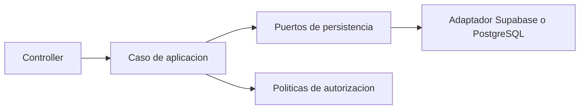

# Arquitectura Fase 1A

## Alcance

Fase 1A prepara el modelo relacional de personas, responsables, configuracion
institucional, ciclos y periodos de matricula. No ejecuta migraciones ni cambia
contratos de backend o frontend. Cargos, pagos y toda la logica financiera
permanecen fuera de esta fase.

## Modelo B definitivo

La matricula conserva directamente `alumno_id`, `ciclo_id`, `grado_id`,
`seccion_id`, `registrado_por`, `fecha_matricula` y `estado`. Fase 1A agrega
solo `periodo_matricula_id`, `fecha_anulacion` y `motivo_anulacion`.

La alternativa A, con oferta academica, secciones por ciclo, cupo y jornada por
ciclo, se conserva en `database/migrations/future/` como referencia no
ejecutable. No forma parte de Fase 1A.

## Limites y dependencias

Los modulos se comunican por contratos cohesivos. Los controllers no conocen
Supabase ni PostgreSQL. Un futuro `RegistrarMatriculaUseCase` coordinara
repositorios de alumno, oferta, matricula y obligaciones dentro de una unica
transaccion, sin que Matriculas dependa del modulo Finanzas.

Las politicas de autorizacion futuras se separan por responsabilidad:
`IPoliticaAccesoAlumno`, `IPoliticaAccesoFinanciero` e `IPoliticaMatricula`.
Fase 1A no endurece RLS ni cambia el comportamiento de acceso existente; esa
activacion corresponde a Fase 1B.

## Decisiones de dominio

- Toda entidad principal usa UUID interno como PK y las FK usan UUID.
- Persona es global dentro de SchoolManager; una persona puede ser responsable
  en distintas instituciones, pero una cuenta de usuario representa una sola
  persona.
- RNE es un identificador educativo distinto de la PK, nullable y unico global
  cuando existe. La comparacion es exacta hasta definir su formato oficial.
- El documento civil pertenece a Persona. Se conserva su representacion y una
  version normalizada para comparacion y unicidad.
- `pais_emisor` es nullable. En una fase posterior, ciertos tipos documentales,
  como pasaporte, podran requerirlo por configuracion sin hardcodear paises.
- Un alumno puede tener varios responsables activos, pero a lo sumo uno puede
  ser responsable principal activo.
- Grado y seccion pertenecen a la matricula y al ciclo, no a la identidad
  permanente del alumno. La oferta anual queda pospuesta como evolucion futura.
- La institucion de un periodo se deriva de su ciclo; no se duplica en periodos.

## Compatibilidad

Las tablas y columnas legacy permanecen. Las columnas nuevas se agregan
anulables y ninguna fuente de lectura cambia durante esta fase. El backfill
ejecutable queda fuera de las migraciones y requiere conciliacion previa.

## Pruebas por fase

Fase 1A cubre pruebas de integracion del esquema y migraciones en una base
aislada. No se crean clases de dominio artificiales para aumentar cobertura.

Fase 1B incorpora casos de aplicacion, autorizacion y sus pruebas unitarias.
Fase 2 incorpora transacciones financieras y pruebas ACID de pagos,
obligaciones, aplicaciones y rollback.

## Fase 2

Fase 2 tratara obligaciones, aplicaciones de pago, pagos parciales, saldos,
anulaciones financieras, descuentos, becas, recargos y ajustes. La invariante
financiera sera: saldo igual a monto total menos aplicaciones validas; estado
pagada con saldo cero, pendiente o vencida con saldo positivo segun vencimiento.
