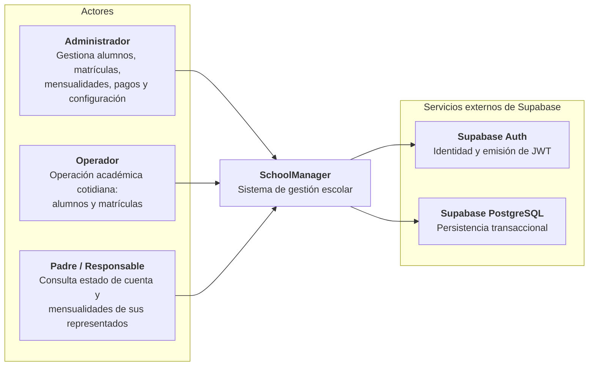
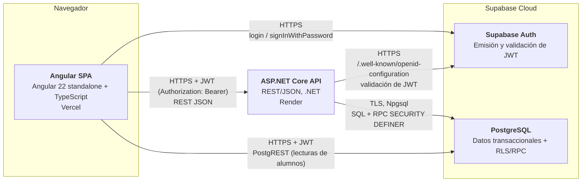

# Arquitectura de SchoolManager

> Documento de arquitectura del Capstone de Ingeniería de Software 2.
> Describe la arquitectura **real** del sistema tal como está implementada en
> `main`, sin componentes inventados.

## Propósito

SchoolManager es un sistema de gestión escolar para administrar alumnos,
matrículas, mensualidades, pagos y el acceso de padres de familia. Permite a una
institución educativa llevar el registro académico y financiero de sus
estudiantes, y permite a los padres consultar la información de sus
representados.

La aplicación se construye como un **monolito modular**: un frontend Angular,
una API ASP.NET Core y una base de datos PostgreSQL alojada en Supabase. Se
evitan de forma deliberada microservicios, CQRS, MediatR, Generic Repository y
UnitOfWork artificial, porque el dominio no lo justifica.

## Decisiones de arquitectura registradas

Las decisiones de persistencia y de autenticación/autorización están
documentadas como ADR y enlazadas desde este documento:

- [ADR-001 — Persistencia](adr/ADR-001-persistencia.md)
- [ADR-002 — Autenticación y autorización](adr/ADR-002-autenticacion-autorizacion.md)

## Modelo de despliegue

| Capa | Tecnología | Despliegue |
| --- | --- | --- |
| Frontend | Angular 22 standalone + TypeScript | Vercel |
| Backend | ASP.NET Core Web API (.NET) | Render (Docker) |
| Base de datos | Supabase PostgreSQL 16 | Supabase Cloud |
| Autenticación | Supabase Auth + JWT | Supabase Cloud |

---

## C4 Nivel 1 — Diagrama de Contexto

**Explicación.** El usuario humano interactúa con el sistema a través de una
aplicación web en el navegador. SchoolManager depende de dos servicios
alojados en Supabase: **Auth**, que emite los JWT con los que se autentican las
peticiones, y **PostgreSQL**, que es la fuente de verdad transaccional de todos
los datos académicos y financieros. El backend nunca guarda identidad por su
cuenta: delega el login en Supabase Auth.

Los roles son `admin`, `operador`, `padre`, y se reservan `docente` y `cajero`
para módulos futuros. `padre` es un rol de consulta vinculado a sus
representados.

---

## C4 Nivel 2 — Diagrama de Contenedores

**Explicación.** Existen tres contenedores con protocolos distintos y reales:

1. **Angular SPA** (alojada en Vercel) es la interfaz. Hace `signInWithPassword`
   contra Supabase Auth para obtener una sesión (id_token + access_token), y
   adjunta el `access_token` como `Authorization: Bearer <JWT>` en cada petición
   a la API mediante un interceptor HTTP (`JwtInterceptor`). Además lee algunas
   tablas (p. ej. alumnos) de forma directa vía PostgREST de Supabase, lo cual
   está limitado por las políticas RLS del rol `authenticated`.
2. **ASP.NET Core API** (alojada en Render) expone REST/JSON bajo `/api`
   (`/api/auth`, `/api/alumnos`, `/api/matriculas`, `/api/conceptos-financieros`,
   `/api/planes-pago`). Valida el JWT de cada petición contra el issuer de
   Supabase Auth (JWT Bearer, algoritmo ECDSA ES256) y resuelve roles y
   permisos del usuario consultando las tablas RBAC.
3. **Supabase PostgreSQL** es la fuente de verdad. La API accede con Npgsql,
   abre transacciones, fija el claim del JWT para que las políticas RLS
   reconozcan al usuario (`set_config('request.jwt.claim.sub', ...)`) y ejecuta
   funciones RPC `SECURITY DEFINER` para las escrituras críticas (matrículas,
   cambios de estado, creación de alumnos, etc.). Las tablas tienen RLS
   habilitada y los permisos SQL están revocados del rol `anon` y acotados para
   `authenticated`.

### Protocolos entre contenedores

| Origen | Destino | Protocolo / medio |
| --- | --- | --- |
| Navegador | Angular SPA | HTTPS (Vercel) |
| Angular SPA | Supabase Auth | HTTPS, SDK `@supabase/supabase-js` |
| Angular SPA | ASP.NET API | HTTPS, REST/JSON, `Authorization: Bearer <JWT>` |
| Angular SPA | Supabase PostgreSQL | HTTPS, PostgREST (lecturas con RLS) |
| ASP.NET API | Supabase Auth | HTTPS, OpenID Configuration (issuer) |
| ASP.NET API | Supabase PostgreSQL | TLS, Npgsql (SQL y RPC) |

---

## Actores y permisos de aplicación

Los permisos siguen un esquema RBAC de tres niveles
`permisos → roles_permisos → usuarios_roles`, con códigos de la forma
`<modulo>.<recurso>.<accion>`, por ejemplo `academico.matriculas.crear` o
`configuracion.planes_pago.editar`. Cada endpoint de la API declara el permiso
que exige con `[Authorize(Policy = ...)]`.

| Actor | Permisos típicos | Acceso |
| --- | --- | --- |
| `admin` | Todos los permisos (conjunto base completo) | Lectura y escritura |
| `operador` | Núcleo académico: alumnos y matrículas | Lectura y escritura académica |
| `padre` | Consulta vinculada a sus representados | Solo lectura de su ámbito |

No hay checks hardcodeados por rol en el código; la autorización se basa en
permisos, y cada fila leída se filtra además por el ámbito institucional del
usuario que actúa (ver [ADR-002](adr/ADR-002-autenticacion-autorizacion.md)).

## Multiinstitución

El modelo es multiinstitución: cada registro operativo (alumno, matrícula,
sección, ciclo, responsable) tiene `institucion_id`. La asignación de un rol a
un usuario puede ser global (`institucion_id NULL`) o específica de una
institución. En modo **single** el sistema resuelve la institución activa; el
modo **multi** con selector global de institución aún está pendiente. Toda
lectura filtra cada fila contra el ámbito real del usuario
(`usuario_tiene_permiso_actual(permiso, institucion_id)`).

---

## Alcance (qué NO se documenta aquí)

Este documento cubre C4 Nivel 1 y Nivel 2. No se incluyen los Niveles 3 y 4
(componentes y código) porque para el propósito del Capstone los contenedores
descritos son suficientes y evitan sobrearquitectura innecesaria.

## Referencias

- [ADRs](adr/) — decisiones registradas.
- [docs/AI_CONTEXT.md](AI_CONTEXT.md) — estado funcional y roadmap.
- [README.md](../README.md) — guía de puesta en marcha y despliegue.
