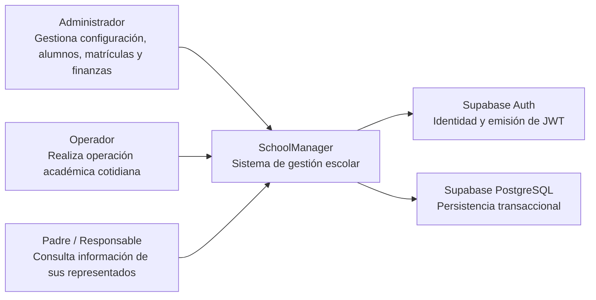
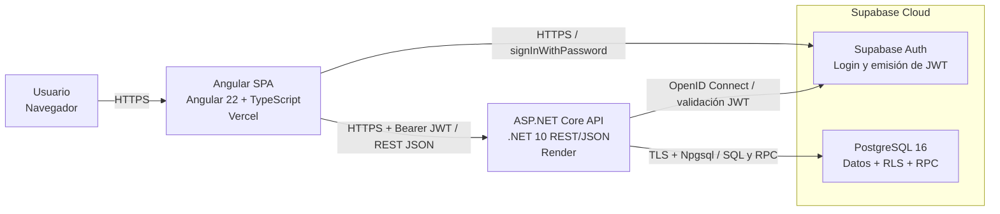

# Arquitectura de SchoolManager

> Documento de arquitectura del Capstone de Ingeniería de Software 2.
> Describe la arquitectura real del sistema implementado actualmente.

## Propósito

SchoolManager es un sistema de gestión escolar para administrar alumnos,
matrículas, mensualidades, pagos, configuración académica y el acceso de
responsables. La institución educativa utiliza una aplicación web para operar
los procesos académicos y financieros, mientras que los responsables consultan
la información permitida de sus representados.

La solución se mantiene como un **monolito modular** compuesto por un frontend
Angular, una API ASP.NET Core y PostgreSQL administrado en Supabase. La lógica
de negocio del frontend pasa por la API .NET; el acceso directo desde Angular a
Supabase se conserva únicamente para autenticación.

## Decisiones de arquitectura registradas

- [ADR-001 — Persistencia](adr/ADR-001-persistencia.md)
- [ADR-002 — Autenticación y autorización](adr/ADR-002-auth.md)

## Modelo de despliegue

| Capa | Tecnología | Despliegue |
| --- | --- | --- |
| Frontend | Angular 22 standalone + TypeScript | Vercel |
| Backend | ASP.NET Core Web API (.NET 10) | Render |
| Base de datos | PostgreSQL 16 | Supabase Cloud |
| Autenticación | Supabase Auth + JWT | Supabase Cloud |

---

## C4 Nivel 1 — Diagrama de Contexto

**Explicación.** Los usuarios interactúan con SchoolManager desde el navegador.
Supabase Auth administra la identidad y emite los JWT de sesión. PostgreSQL es
la fuente de verdad para los datos académicos, financieros y de autorización.
El sistema utiliza roles y permisos para limitar qué operaciones puede realizar
cada usuario.

---

## C4 Nivel 2 — Diagrama de Contenedores

**Explicación.** La SPA Angular se publica en Vercel y presenta la interfaz al
usuario. El login se realiza directamente contra Supabase Auth. Después de
obtener la sesión, Angular adjunta el `access_token` como `Authorization:
Bearer <JWT>` en las peticiones a la API.

La API ASP.NET Core alojada en Render es la frontera de negocio del sistema.
Expone los endpoints REST, valida el JWT, aplica las políticas de autorización
y ejecuta las operaciones contra PostgreSQL mediante Npgsql. Las operaciones
transaccionales críticas se apoyan en SQL y funciones RPC de PostgreSQL.

Desde la migración de la capa de negocio a la API, Angular **no consulta tablas
de negocio mediante PostgREST**. El SDK de Supabase permanece en el frontend
solo para autenticación y manejo de sesión.

### Protocolos entre contenedores

| Origen | Destino | Protocolo / medio |
| --- | --- | --- |
| Navegador | Angular SPA | HTTPS |
| Angular SPA | Supabase Auth | HTTPS, `@supabase/supabase-js` |
| Angular SPA | ASP.NET Core API | HTTPS, REST/JSON, Bearer JWT |
| ASP.NET Core API | Supabase Auth | HTTPS, OpenID Connect / metadata JWT |
| ASP.NET Core API | PostgreSQL | TLS, Npgsql, SQL y RPC |

---

## Seguridad y autorización

La autenticación se delega en Supabase Auth. La API valida el JWT y resuelve la
autorización con permisos de aplicación. Los permisos utilizan códigos como
`academico.matriculas.crear` o `configuracion.planes_pago.editar`, y los
endpoints protegidos declaran la política correspondiente.

Los roles principales son `admin`, `operador` y `padre`. La autorización no se
resuelve mediante condicionales de rol dispersos en la interfaz, sino mediante
permisos y el ámbito institucional correspondiente.

## Persistencia

PostgreSQL es la fuente de verdad del sistema. Se utilizan claves internas UUID,
restricciones de integridad, transacciones, RLS y funciones RPC para proteger
invariantes del dominio. La API .NET actúa como capa de acceso y orquestación;
no se duplica la lógica transaccional que pertenece a la base de datos.

## Multiinstitución

El modelo de datos contempla múltiples instituciones mediante
`institucion_id`. En una instalación de una sola institución el contexto puede
resolverse automáticamente. El selector global para operar varias instituciones
desde la misma interfaz se considera una ampliación posterior y no modifica el
modelo base descrito aquí.

---

## Alcance del documento

Para el Capstone se documentan los niveles **C4 Contexto (Nivel 1)** y
**Contenedores (Nivel 2)**. No se agregan niveles 3 y 4 porque el objetivo es
mostrar las fronteras y responsabilidades principales sin duplicar el detalle
que ya existe en el código fuente.

## Referencias

- [ADR-001 — Persistencia](adr/ADR-001-persistencia.md)
- [ADR-002 — Autenticación y autorización](adr/ADR-002-auth.md)
- [Contexto técnico del proyecto](AI_CONTEXT.md)
- [README](../README.md)
