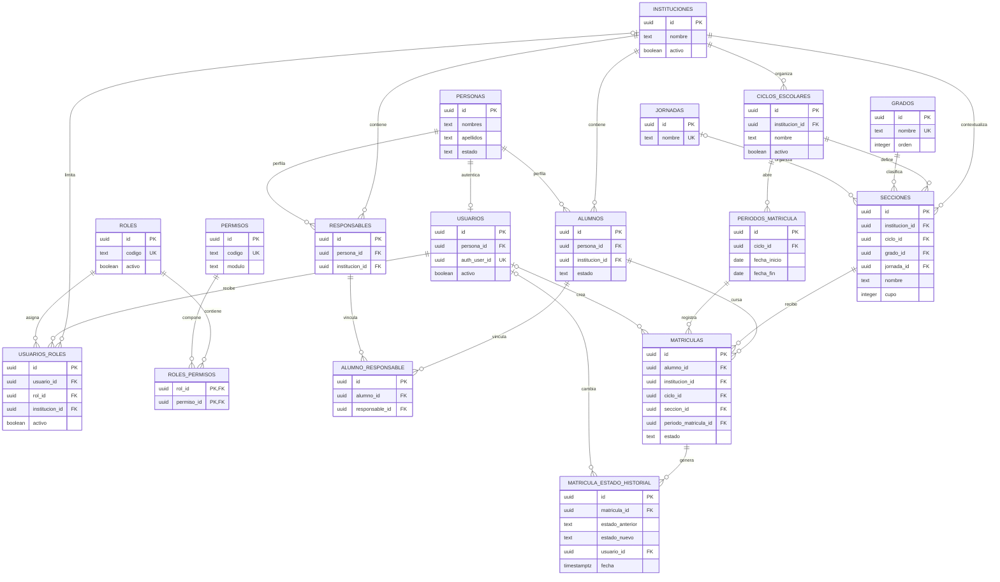

# Diagrama entidad-relación

## Frontera de seguridad

El ERD representa relaciones, no policies. Las tablas de identidad, RBAC y
académicas del diagrama tienen RLS habilitada para lecturas de
`authenticated`; el ámbito se resuelve desde `auth.uid()` y
`usuarios_roles.institucion_id`. Las escrituras transaccionales y la gestión de
roles se realizan mediante las funciones `rpc_*`, no con DML directo desde el
cliente. El detalle está en [SUPABASE_SECURITY.md](SUPABASE_SECURITY.md).
