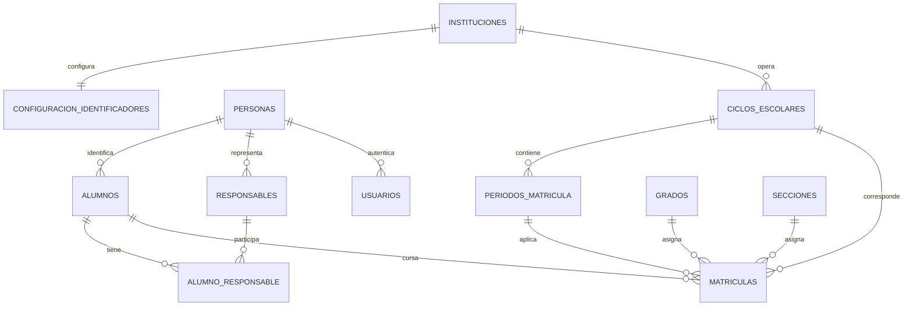
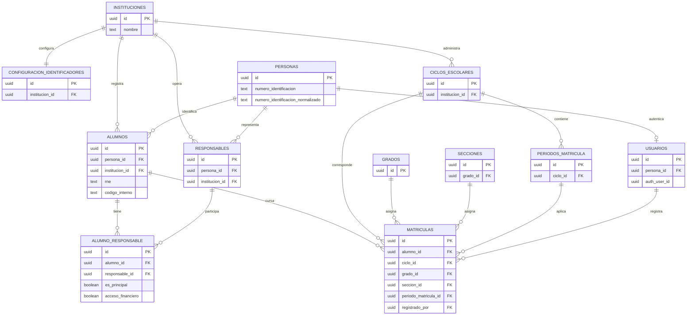

# Modelo de Datos Fase 1A

## Entidades nuevas

| Tabla | Proposito |
| --- | --- |
| `instituciones` | Configuracion organizacional. |
| `configuracion_identificadores` | Politica institucional de identificadores. |
| `personas` | Identidad y contacto globales. |
| `responsables` | Rol de responsable por institucion. |
| `alumno_responsable` | Relacion familiar N:M y permisos. |
| `periodos_matricula` | Ventanas de matricula por ciclo. |

## Relaciones

La institucion de un periodo se deriva de su ciclo. La matricula mantiene
directamente alumno, ciclo, grado y seccion; la oferta anual queda pospuesta.

## Identificadores

`personas.numero_identificacion` conserva el valor presentado. Su campo
`numero_identificacion_normalizado` sirve para comparar y aplicar unicidad.
La normalizacion es generica y no impone formatos nacionales.

RNE es nullable en `alumnos` y unico global cuando existe. Su comparacion es
exacta: no se aplica `lower`, trim, regex ni normalizacion hasta disponer de una
especificacion formal. `codigo_interno` es nullable y unico por institucion.

## Restricciones relevantes

- Las PK y FK usan UUID.
- `UNIQUE(alumno_id, responsable_id)` evita relaciones duplicadas.
- Un indice unico parcial permite como maximo un responsable principal activo.
- El indice unico parcial de codigo interno protege su contexto institucional.
- El indice unico parcial global de RNE protege los valores no nulos con
    comparacion exacta.
- Checks validan estados, fechas ordenadas y texto no vacio.

## Datos legacy

No se eliminan ni se vuelven fuente secundaria en Fase 1A: los campos actuales
de alumnos, usuarios, ciclos y matriculas siguen disponibles para consumidores
existentes. `padres_encargados` es texto no estructurado y nunca se transforma
automaticamente en personas o responsables.

## Diagrama ER final

