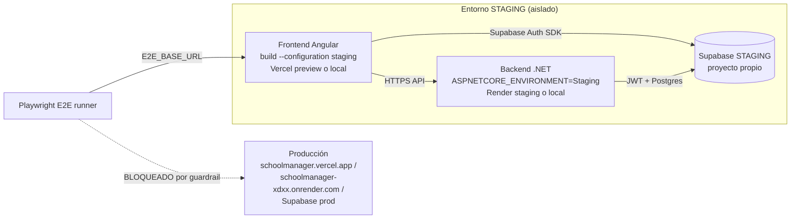

# Plan E2E autenticado + staging

> Documento de planificación. **No implementa cambios de código, infraestructura
> ni workflows** — es la base acordada para los bloques `E2E-01` a `E2E-06`
> descritos al final. Complementa a [docs/ci/e2e-auth-setup.md](../ci/e2e-auth-setup.md),
> que documenta las acciones humanas ya identificadas en el Bloque 029.

## 1. Diagnóstico actual del harness E2E

| Aspecto | Estado |
|---|---|
| Herramienta E2E | Playwright 1.48.0 en [`e2e/`](../../e2e/), aislado del frontend Angular |
| Smoke no autenticado | Operativo — `e2e/tests/smoke.spec.ts` (3/3 tests verdes en local) |
| Auth E2E | Escrito pero skippeado — `e2e/tests/auth.spec.ts` requiere `E2E_STAGING=1`, `E2E_USER_EMAIL`, `E2E_USER_PASSWORD`; si faltan, el spec se salta con mensaje honesto (no falso-verde) |
| Guardrail anti-producción | Existe en `e2e/playwright.config.ts` (`assertNonProductionBaseUrl`); bloquea `E2E_BASE_URL` que apunte a hosts de producción conocidos, salvo `E2E_ALLOW_PROD=1`. Solo valida la URL base del frontend, no el Supabase/API que ese build tiene embebido — ver sección 3 |
| `environment.staging.ts` | No existe (solo `environment.ts` y `environment.prod.ts`, ambos apuntan al proyecto Supabase de producción) |
| Backend staging | No provisionado; `appsettings.json` tiene un único `Jwt.Issuer` fijo al Supabase de producción |
| Supabase staging | No provisionado |
| CI (`deploy.yml`) | Build + tests en cada PR/push; no ejecuta E2E actualmente |
| Bloque 030 (migración a API .NET) | **CERRADO** — PR #53 mergeado a `main` (commit `61f7736`). Deuda #10 (accesos directos a Supabase desde el frontend de negocio) **RESUELTA**; único acceso directo restante es `auth.ts` (Supabase Auth, deliberado) |
| Migraciones 023/024 (RBAC de aplicación para ciclos y estructura académica) | Aditivas, ya en `main`; **pendientes de aplicación manual en Supabase** tras la revisión/CI correspondiente, según lo documentado en `docs/AI_CONTEXT.md` |
| RBAC/RLS multiinstitución | Sólido (migraciones 009, 020, 023, 024) — base adecuada para probar aislamiento cross-institución en E2E |

**Conclusión:** con el cierre de 030 y la resolución de la deuda #10, el frontend de negocio ya habla exclusivamente con la API .NET (salvo Auth). El único bloqueador real para el E2E autenticado sigue siendo de **infraestructura**: staging de Supabase, backend y frontend, más credenciales de prueba — no de código ni de arquitectura.

## 2. Arquitectura propuesta de staging

- **Frontend staging:** nueva configuración `staging` en `angular.json` (`fileReplacements`) y `environment.staging.ts` (no incluidos todavía, ver Bloque `E2E-01`). Deploy recomendado: Vercel preview dedicado a una rama `staging`, o build servido localmente en el runner de CI.
- **Backend staging:** servicio separado (`ASPNETCORE_ENVIRONMENT=Staging`, `appsettings.Staging.json` propio) — Render dedicado o ejecución local (`dotnet run --environment Staging`) en el runner de CI. Nunca comparte `ConnectionStrings` ni `Jwt.Issuer` con producción.
- **Base de datos staging:** proyecto Supabase Postgres separado, con las migraciones aplicadas de forma manual (mismo proceso que producción, proyecto distinto). Nunca clonar datos reales de producción.
- **Supabase Auth staging:** usuarios de prueba creados en el proyecto Supabase de staging, nunca en el de producción.
- **Dominios/orígenes permitidos:** el dominio del frontend staging se agrega solo a `Cors.AllowedOrigins` de `appsettings.Staging.json`, nunca al de producción.

**Recomendación de bajo costo:** priorizar un staging "efímero" en el propio runner de CI (API + frontend corriendo localmente en el job) contra un proyecto Supabase de staging persistente y gestionado fuera del repositorio. Un despliegue staging persistente en Render/Vercel queda como opción para pruebas manuales exploratorias, no como requisito para CI.

## 3. Separación estricta de producción

Estrategia de varias capas, no un único guardrail:

1. **Allowlist en vez de blocklist** (mejora sobre lo actual): invertir el guardrail de `playwright.config.ts` para permitir explícitamente los hosts de staging conocidos (`localhost:4200`, dominio staging) y bloquear todo lo demás por defecto, en vez de enumerar hosts de producción (una allowlist no se puede "olvidar de actualizar" cuando aparece un nuevo host de prod).
2. **Cerrar el vacío detectado:** el guardrail actual solo valida `E2E_BASE_URL`, no el Supabase/API real que ese build tiene embebido. Un build "staging" servido en `localhost:4200` podría seguir apuntando por error a Supabase de producción. Propuesta: un `global-setup.ts` de Playwright que consulte el `environment` real cargado por la app (expuesto solo en builds no-productivos) y aborte si el `supabaseUrl`/`apiUrl` coincide con producción.
3. **Fail-fast al arranque del backend:** si `ASPNETCORE_ENVIRONMENT != Production` pero la configuración cargada (`Jwt.Issuer`, `ConnectionStrings`) coincide con los valores conocidos de producción, el proceso debe rechazar el arranque.
4. **Protección contra operaciones destructivas:** cualquier seed/reset debe verificar que opera contra un proyecto marcado como staging antes de cualquier `DELETE`/`TRUNCATE`, y el usuario de base de datos de seed debe tener permisos acotados.
5. **Aislamiento de secretos en CI:** el job de E2E solo debe tener acceso a secrets de un *environment* `staging` de GitHub, nunca a los secrets de despliegue de producción (`RENDER_DEPLOY_HOOK_URL`, etc.).

## 4. Credenciales E2E

**Usuarios de prueba mínimos (Supabase Auth staging):**

| Usuario | Rol/permisos | Uso |
|---|---|---|
| admin de institución A | rol `admin`, permisos `academico.*` completos | Flujos CRUD: alumnos, matrícula, ciclos, estructura académica |
| usuario de solo lectura | únicamente `academico.*.ver` | Casos negativos de autorización (403) |
| admin de institución B | rol `admin` en institución distinta | Casos negativos cross-institución |
| responsable (portal) | rol responsable | Portal responsable, si el módulo lo requiere |

**Dónde y cómo:**
- Secretos de CI: *environment secrets* de GitHub Actions bajo un environment `staging` dedicado (`E2E_USER_EMAIL`, `E2E_USER_PASSWORD`, credenciales del segundo usuario/institución, URL de Supabase/API de staging).
- Uso local: variables de entorno o un archivo ignorado por git (nunca en `environment.staging.ts`, que solo debe llevar valores públicos como la anon key).
- Rotación: contraseñas de usuarios de prueba se regeneran periódicamente en Supabase Auth staging, actualizando el secret de GitHub correspondiente.
- **Nunca versionar:** contraseñas, `service_role key` de Supabase, connection strings con credenciales, ni ningún token real. Este documento no incluye ningún valor sensible.

## 5. Dataset, seed y reset

Dataset mínimo reproducible:

- 1 institución de staging (+ una segunda institución para pruebas cross-institución).
- 1 ciclo escolar vigente y 1 período de matrícula abierto.
- 1 grado, 1 jornada y 1 sección activa por institución.
- Los usuarios de prueba de la sección 4, vinculados a su fila en `usuarios`.
- 1 alumno preexistente (para listar/editar) más la capacidad de crear alumnos nuevos dentro de cada test.
- 1 matrícula en estado `activa` sobre el alumno preexistente (para probar cambios de estado).
- Datos financieros mínimos **solo si algún caso E2E los ejercita**; no sembrar datos sin un test que los consuma.

**Estrategia:**
- Seed idempotente y determinista (UUIDs conocidos o expuestos mediante un mecanismo de solo-staging).
- Cada test que crea datos propios (alumno nuevo, matrícula nueva) los limpia al finalizar, para mantener el paralelismo seguro.
- Un reset completo del dataset semilla se reserva para ejecuciones `nightly` o manuales, no para cada PR.

## 6. Matriz de casos E2E

### Casos positivos

| # | Caso | Prioridad |
|---|---|---|
| 1 | Login correcto → dashboard | P0 |
| 2 | Navegación AppShell (menú, cambio de sección, logout) | P0 |
| 3 | Listar alumnos | P0 |
| 4 | Crear alumno | P0 |
| 5 | Matricular alumno | P0 |
| 6 | Cambio de estado de matrícula (con motivo cuando aplica) | P0 |
| 7 | Listar/crear ciclos y períodos | P1 |
| 8 | Estructura académica (grados/jornadas/secciones) CRUD básico | P1 |
| 9 | Portal responsable (si el módulo está activo) | P2 |

### Casos negativos

| # | Caso | Resultado esperado |
|---|---|---|
| N1 | Login incorrecto | Rechazo con mensaje, sin sesión |
| N2 | Acceso no autenticado a ruta protegida | Redirección a `/login` |
| N3 | Autorización por permisos (usuario de solo lectura intenta escribir) | 403 / UI sin acciones de escritura |
| N4 | Llamada a API sin token | 401 |
| N5 | Recurso inexistente (UUID inválido) | 404 |
| N6 | Transición de estado de matrícula no permitida | 409 |
| N7 | Cross-institución: usuario A intenta ver/editar recurso de institución B | 403/404, nunca 200 con datos ajenos |
| N8 | Token expirado o con firma inválida | 401 |

## 7. Estrategia CI/CD

- **PR contra `main`:** solo el smoke E2E no autenticado (rápido, sin dependencia de staging).
- **Auth E2E completo:** no en cada PR — se ejecuta en `workflow_dispatch` (manual, antes de un release o tras cambios sensibles a auth/permisos) y opcionalmente en un job `nightly` (`schedule`) contra staging.
- **Artifacts:** en fallo, subir `test-results/` (screenshots + traces) con retención corta.
- **Timeouts/retries:** mantener `retries: 2` en CI; timeout por test 30–60s; timeout de suite ~10 min.
- El job de E2E se mantiene separado del job `deploy`, para no acoplar la disponibilidad de staging al despliegue de producción.

## 8. Decisión sobre la herramienta

**Se mantiene Playwright.** Ya está instalado, aislado del frontend, con guardrails funcionando y documentación asociada. No se identificó ninguna limitación (paralelización, trazas, soporte CI) que justifique una migración de herramienta; migrar sería costo sin valor y está fuera de alcance.

## 9. Costos y estabilidad (flakiness)

- Preferir selectores estables (`data-testid`) sobre selectores frágiles de texto/CSS.
- Esperar por respuestas de red reales en vez de timeouts fijos.
- Aislar tests: cada uno crea y limpia sus propios datos.
- Mantener `fullyParallel: true`; los datos de seed compartidos (institución, ciclo) son de solo lectura para los tests en paralelo.
- Reset completo de datos solo en `nightly`/manual.
- Duración objetivo: smoke < 30s; suite autenticada completa < 5 min en CI.

## 10. Plan de implementación por bloques

| Bloque | Alcance |
|---|---|
| **E2E-01** — Infraestructura staging | Proyecto Supabase de staging, aplicación de migraciones (incluidas 023/024 si aún no se aplicaron), backend de staging, `environment.staging.ts` y configuración `staging` en `angular.json` |
| **E2E-02** — Auth + secretos + guardrails reforzados | `appsettings.Staging.json`, fail-fast de arranque, endpoint de salud con el nombre del ambiente, *environment* `staging` en GitHub con sus secrets, allowlist de hosts, `global-setup.ts` de validación |
| **E2E-03** — Seed/reset | Script de seed idempotente (institución, ciclo, período, grado, jornada, sección, usuarios, alumno, matrícula) y mecanismo de reset acotado a staging |
| **E2E-04** — Smoke tests | Confirmar que `smoke.spec.ts` sigue verde tras los cambios de configuración de E2E-01/02 |
| **E2E-05** — Flujos de negocio | Activar `auth.spec.ts` y agregar los specs de la matriz de la sección 6 (positivos y negativos) |
| **E2E-06** — CI/hardening | Workflow de E2E (manual + nightly), artifacts, timeouts/retries, actualización de `docs/ci/e2e-auth-setup.md` |

Cada bloque se implementa en una rama corta independiente y no requiere tocar los controladores ni servicios ya migrados en el Bloque 030 (cerrado); solo agrega infraestructura y specs de prueba nuevos.

## 11. Riesgos

- Costo/mantenimiento de un segundo proyecto Supabase de forma indefinida — mitigado reutilizando el mismo proyecto de staging para CI y pruebas manuales.
- Drift de esquema entre staging y producción si una migración se aplica solo en un ambiente — mitigar con un checklist explícito por migración nueva.
- Flakiness inherente a depender de servicios reales (Supabase Auth, backend real) en vez de mocks — aceptado como trade-off del E2E real, mitigado con retries y timeouts.
- Fuga de datos si se versiona por error un `environment.staging.ts` con algo más que la anon key pública — mitigar con revisión de PR al implementarlo en `E2E-01`.
- Las migraciones 023/024 siguen pendientes de aplicación manual en Supabase; si no se aplican antes de `E2E-03`, los permisos de aplicación para ciclos/estructura académica no estarán disponibles en staging y los casos E2E correspondientes (sección 6, casos 7 y 8) no podrán ejecutarse hasta aplicarlas.

## 12. Criterio de "E2E staging listo"

Se considera listo cuando:

1. `auth.spec.ts` corre en verde (no skippeado) contra staging real, sin tocar producción.
2. Los casos positivos y negativos de la sección 6 tienen spec implementado y verde.
3. El workflow de CI (`workflow_dispatch` + `nightly`) ejecuta la suite completa y publica artifacts en fallo.
4. El guardrail anti-producción bloquea, de forma verificable, tanto un `E2E_BASE_URL` de producción como un build cuyo Supabase/API embebido sea el de producción.
5. El seed es reproducible: correr reset + seed dos veces seguidas produce el mismo estado sin errores.
6. `docs/ci/e2e-auth-setup.md` queda actualizado reflejando el proceso real ya operativo, no pendiente de acción humana.
